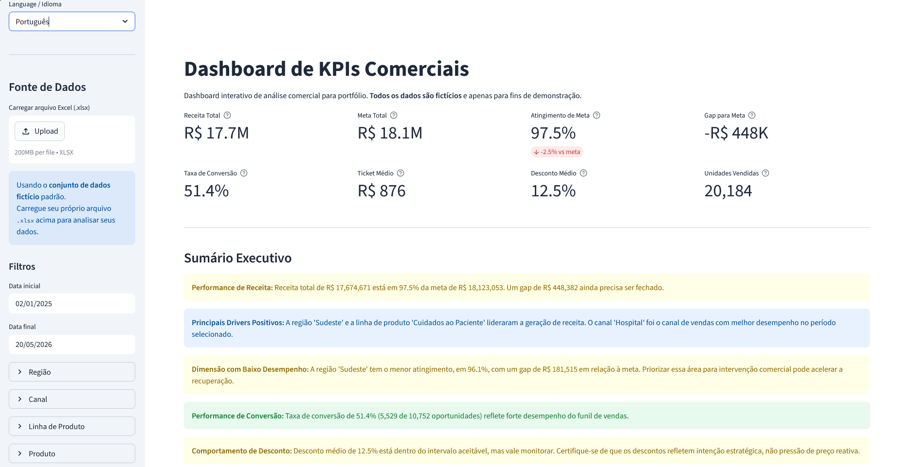

# Dashboard Comercial de KPIs

> Dashboard interativo de análise comercial desenvolvido com Python e Streamlit.
> Todos os dados são **fictícios e gerados aleatoriamente** — projeto de portfólio, sem dados reais de nenhuma empresa.

[](https://python.org)
[](https://streamlit.io)
[](https://plotly.com)
[](tests/)
[](data/)

> **Aviso importante:** todos os dados, nomes de produtos, regiões, representantes e resultados presentes neste projeto são **completamente fictícios e gerados aleatoriamente**. Este projeto **não é afiliado, patrocinado nem representativo** de nenhuma empresa real, incluindo Johnson & Johnson ou qualquer outra organização.

---

## Capturas do Dashboard

As imagens abaixo mostram o dashboard Streamlit em execução com dados fictícios de amostra.


*Visão geral — cards de KPI, resumo executivo e gráficos de tendência mensal*


*Diagnóstico de performance — breakdowns por região, canal e linha de produto*

---

## Início Rápido

Para recrutadores e entrevistadores — coloque o dashboard em funcionamento em menos de dois minutos:

```powershell
pip install -r requirements.txt           # 1. instalar dependências
python src/sample_data_generator.py       # 2. gerar dataset fictício
streamlit run app.py                      # 3. abrir http://localhost:8501
python -m pytest -v                       # 4. rodar os 68 testes unitários
```

O que explorar no dashboard:
- Use os **filtros na barra lateral** para segmentar por período, Região, Canal ou Linha de Produto
- Leia o **Resumo Executivo** com diagnósticos em cores (verde/amarelo/vermelho)
- Acesse as abas de **Diagnóstico de Performance** por região, canal e linha de produto
- Clique nos **botões de exportação** para baixar os dados filtrados como CSV
- Envie seu próprio arquivo `.xlsx` pela barra lateral (veja o [esquema esperado](#usando-seu-próprio-arquivo-excel) abaixo)

---

## Por que este projeto é relevante para recrutadores?

Este projeto foi desenvolvido para demonstrar competências práticas aplicadas a um contexto comercial e de vendas — habilidades diretamente relevantes para vagas de **analista de dados, analista de BI, analista comercial, analista de vendas** e posições similares.

| Competência demonstrada | Como aparece no projeto |
|------------------------|------------------------|
| Organização e tratamento de dados | Limpeza de planilha Excel, validação de schema, derivação de colunas |
| Análise baseada em Excel | Leitura de `.xlsx` com Pandas e OpenPyXL, suporte a upload de arquivo próprio |
| Cálculo de KPIs comerciais | Receita vs. meta, atingimento, conversão, ticket médio, desconto médio |
| Desenvolvimento de dashboard | Interface interativa com Streamlit e filtros reativos |
| Interpretação de negócio | Resumo executivo com classificação automática (bom/alerta/ruim) |
| Análise de suporte à decisão | Diagnósticos de desempenho por região, canal e linha de produto |
| Python limpo e testável | Lógica de negócio separada da interface, 68 testes unitários |
| Comunicação de insights | Geração automática de comentários de negócio a partir dos dados |

---

## O Problema de Negócio

Equipes comerciais frequentemente trabalham com planilhas Excel estáticas e precisam responder a perguntas como:

- A receita está batendo a meta? Qual é o gap?
- Qual região ou canal está puxando ou travando os resultados?
- A taxa de conversão de oportunidades está dentro do esperado?
- O desconto médio está controlado ou está corroendo a margem?
- Quais produtos ou linhas têm melhor desempenho?

Este dashboard transforma uma planilha Excel em uma ferramenta de análise interativa — todos os KPIs, gráficos, diagnósticos e insights se atualizam em tempo real conforme os filtros são aplicados.

---

## O que o Dashboard Analisa

- **Receita vs. Meta** — performance total e gap para qualquer subconjunto filtrado
- **% de Atingimento de Meta** — visão geral, por região, por canal e por linha de produto
- **Taxa de Conversão** — de oportunidade para venda fechada, por canal
- **Comportamento de Desconto** — desconto médio e alerta quando ultrapassa limites seguros
- **Top Produtos e Regiões** — ranking por contribuição de receita
- **Segmentos com Baixo Desempenho** — identificados e sinalizados automaticamente no resumo executivo

---

## Funcionalidades

| Funcionalidade | Descrição |
|----------------|-----------|
| Cards de KPI | 8 métricas principais com moeda formatada (R$), percentuais e delta colorido no Atingimento de Meta |
| Resumo Executivo | Diagnósticos narrativos com cores (receita, motores, conversão, desconto) |
| 7 gráficos Plotly | Tendência mensal, Receita vs. Meta, breakdowns por Região/Canal/Linha, Top Produtos, Conversão por Canal |
| Diagnóstico de Performance | Tabelas por abas com Receita, Meta, Atingimento % e Gap por Região, Canal e Linha de Produto |
| Insights automáticos | 5–6 comentários de negócio gerados por regras a partir dos dados filtrados |
| Filtros na barra lateral | Período, Região, Canal, Linha de Produto, Produto — todos reativos |
| Upload de Excel | Use seu próprio arquivo `.xlsx`; o dataset fictício é carregado por padrão |
| Exportação CSV | Dados filtrados, resumo de KPIs e diagnósticos — todos refletem os filtros aplicados |
| Tabela formatada | Desconto, Atingimento % e Taxa de Conversão exibidos como percentual |
| Interface bilíngue | Alternância completa entre Inglês e Português — rótulos, filtros, gráficos, diagnósticos e insights |

---

## Stack Tecnológica

| Camada | Biblioteca |
|--------|-----------|
| Dashboard | Streamlit |
| Dados | Pandas, OpenPyXL |
| Gráficos | Plotly |
| Numérico | NumPy |
| Testes | Pytest |

---

## Estrutura do Projeto

```
KPI/
├── app.py                           # Ponto de entrada Streamlit (orquestração)
├── requirements.txt
├── README.md
├── .streamlit/
│   └── config.toml                  # Tema visual
├── data/
│   └── sample_commercial_data.xlsx  # Dataset fictício gerado (400 linhas)
├── src/
│   ├── sample_data_generator.py     # Gera o dataset Excel fictício
│   ├── data_loader.py               # Carrega Excel de arquivo ou upload Streamlit
│   ├── data_cleaning.py             # Limpeza de dados e adição de colunas derivadas
│   ├── kpi_calculator.py            # Funções puras de KPI (sem dependência do Streamlit)
│   ├── charts.py                    # Construtores de gráficos Plotly
│   ├── display_map.py               # Mapeamento de nomes para interface bilíngue
│   ├── i18n.py                      # Strings de internacionalização (EN / PT)
│   └── insights.py                  # Insights, resumo executivo e diagnósticos
├── tests/
│   ├── test_kpi_calculator.py       # Testes unitários para lógica de KPI
│   ├── test_insights.py             # Testes para resumo executivo e diagnósticos
│   ├── test_i18n.py                 # Testes para traduções i18n
│   └── test_display_map.py          # Testes para mapeamento de exibição
├── assets/
│   ├── screenshot.png               # Captura 1 — visão geral do dashboard
│   └── screenshot2.png              # Captura 2 — diagnóstico de performance
└── docs/
```

---

## Configuração do Ambiente

### 1. Criar e ativar o ambiente virtual

```powershell
# Windows — PowerShell
python -m venv .venv
.\.venv\Scripts\Activate.ps1
```

> **Nota PowerShell:** se aparecer um erro de política de execução, execute `Set-ExecutionPolicy -Scope CurrentUser RemoteSigned` uma vez e tente novamente.

```bash
# Windows — Prompt de Comando / Git Bash
python -m venv .venv
.venv\Scripts\activate

# macOS / Linux
python -m venv .venv
source .venv/bin/activate
```

### 2. Instalar dependências

```powershell
pip install -r requirements.txt
```

### 3. Gerar o dataset de exemplo

```powershell
python src/sample_data_generator.py
```

Isso cria `data/sample_commercial_data.xlsx` com 400 linhas de dados comerciais fictícios.

### 4. Rodar o dashboard

```powershell
streamlit run app.py
```

Abra `http://localhost:8501` no navegador. O dataset fictício carrega automaticamente.

### 5. Rodar os testes

```powershell
python -m pytest -v
```

---

## Usando o Dataset de Exemplo

Quando nenhum arquivo é enviado, o dashboard carrega `data/sample_commercial_data.xlsx` automaticamente. Esse dataset contém:

- ~17 meses de registros fictícios de vendas (jan/2025 – mai/2026)
- 5 regiões, 5 canais, 5 linhas de produto, 20 produtos, 10 representantes fictícios
- 400 linhas com receita, metas, oportunidades, conversões e descontos aleatórios, mas realistas

---

## Usando Seu Próprio Arquivo Excel

Envie qualquer arquivo `.xlsx` pelo painel **Fonte de Dados** na barra lateral. O arquivo deve conter estas colunas (nomes exatos, sensíveis a maiúsculas/minúsculas):

> Os nomes das colunas devem estar **em inglês** exatamente como listados abaixo, pois o aplicativo valida o schema automaticamente.

| Coluna | Tipo | Descrição |
|--------|------|-----------|
| Date | Data | Data da transação ou período |
| Region | Texto | Nome da região de vendas |
| Channel | Texto | Canal de vendas (ex: Hospital, Varejo) |
| Product Line | Texto | Categoria do produto |
| Product | Texto | Nome do produto |
| Sales Representative | Texto | Nome ou ID do representante |
| Revenue | Número | Valor de receita |
| Target | Número | Meta de receita |
| Opportunities | Inteiro | Número de oportunidades no período |
| Conversions | Inteiro | Número de conversões |
| Units Sold | Inteiro | Unidades vendidas |
| Discount | Número | Taxa de desconto (0,0 a 1,0 — ex: 0,15 para 15%) |

Se alguma coluna obrigatória estiver ausente, o aplicativo exibe um erro listando exatamente quais colunas faltam.

---

## Validação e Testes

O projeto inclui **68 testes unitários** distribuídos em quatro arquivos:

- **`tests/test_kpi_calculator.py`** — todas as 13 funções de KPI, incluindo casos extremos de divisão por zero
- **`tests/test_insights.py`** — `build_dimension_diagnostics` (agregação, atingimento, gap, ordenação) e `generate_executive_summary` (estrutura, lógica de status, caso extremo de região única)
- **`tests/test_i18n.py`** — busca de tradução, fallback de idioma, interpolação com kwargs e paridade de chaves PT/EN
- **`tests/test_display_map.py`** — mapeamento de valores (regiões, canais, linhas de produto), mapeamento reverso, fallback para valor desconhecido, round-trip de filtro e tradução de cabeçalhos de coluna

A lógica de negócio vive inteiramente nos módulos de `src/` sem dependência do Streamlit — pode ser importada, testada e reutilizada de forma independente.

```powershell
python -m pytest -v
```

---

## Status do Projeto

O dashboard está funcional e pronto para portfólio:

- KPIs exibidos com moeda formatada (R$), percentuais e separadores de milhar
- Card de Atingimento de Meta com delta colorido em relação ao objetivo de 100%
- Tabela de dados formata Desconto, Taxa de Conversão e Atingimento como percentuais
- Os 7 gráficos Plotly incluem eixos formatados (prefixo R$) e tooltips no hover
- Resumo Executivo fornece diagnósticos narrativos com código de cores (verde/amarelo/vermelho)
- Abas de Diagnóstico de Performance mostram breakdown dimensional por Região, Canal e Linha de Produto
- 3 botões de exportação CSV refletem o estado atual dos filtros
- Tema visual neutro e profissional — não baseado na identidade visual de nenhuma empresa real
